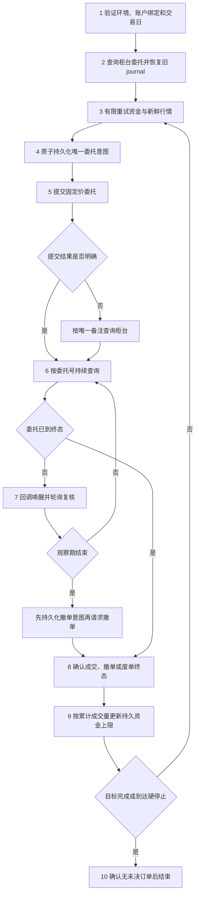

# QMT实时交易接口返回格式与避坑手册

本文面向使用miniQMT/XtQuant编写自动交易程序的项目。结论来自2026-08-03
连接真实模拟柜台的下单、撤单、崩溃恢复和5Hz压力测试；接口版本为
`xtquant-250516.1.1`。模拟柜台不能证明实盘成交模型完全相同，但返回对象、状态机
处理和失败保护同样适用于实盘。更换券商、miniQMT或XtQuant版本后必须重新验证。

## 一、先记住这十条

1. `order_stock()`返回正整数只表示取得委托号，不表示已报、已成交或不会被废单。
2. `cancel_order_stock()`返回`0`只表示撤单请求被接受，不表示委托已经进入终态。
3. `query_stock_order()`可能瞬时返回`None`；有限次重试后仍不可见时必须按“不确定”
   处理，不能假定订单不存在并重新下单。
4. 下单前必须先持久化唯一`order_remark`和完整意图。提交超时或程序崩溃后，只能用
   该备注向柜台恢复，不能盲目补单。
5. 当前柜台回报只可靠保留`strategy_name`前23个ASCII字符；超长名称会被静默截断。
6. 状态`55`是仍活动的部分成交，`51/52`是撤单处理中；它们都不是终态。
7. 一笔委托可能产生多笔`XtTrade`或多次回调。成交数量应按柜台委托的
   `traded_volume`或去重后的成交记录累计，不能数回调次数。
8. `get_full_tick()`中的`time`是13位毫秒时间戳；`XtOrder.order_time`和
   `XtTrade.traded_time`实测为10位秒时间戳。不要共用同一个除数。
9. 当前L1行情约3秒才更新一次。0.2秒轮询能缩短新帧发现延迟，但不会产生5Hz市场
   信息；触发秒必须等待第一份时间戳不早于触发点的新快照。
10. 逆回购成交后`XtAsset.cash`可能仍显示原值，不能直接当作剩余可用资金。必须把
    柜台累计成交本金写入持久账本，并对后续资金设置只减不增的上限。

## 二、调用返回值速查

| 调用 | 当前版本返回 | 正确解释 | 常见错误 |
|---|---|---|---|
| `trader.start()` | 无业务确认 | 仅启动客户端线程 | 当成已连接 |
| `trader.connect()` | `int`，实测成功为`0` | 连接结果 | 未检查非零返回 |
| `trader.subscribe(account)` | `int`，实测成功为`0` | 账户订阅结果 | 与行情订阅序号混淆 |
| `xtdata.subscribe_quote(...)` | 正整数序号 | 行情订阅句柄，供退订使用 | 按`0`成功判断 |
| `trader.order_stock(...)` | 同步接口返回`order_id: int` | 已获得委托号，结果仍需查询 | 正数即视为成交 |
| `trader.order_stock_async(...)` | 请求序号`seq: int` | 不是委托号；委托号来自异步响应 | 用`seq`查询委托 |
| `trader.cancel_order_stock(...)` | `0`成功接受，`-1`失败 | 撤单请求结果 | `0`即视为已撤 |
| `query_stock_asset()` | `XtAsset`或`None` | 某一时刻的资产快照 | `None`当作零资金 |
| `query_stock_order()` | `XtOrder`或`None` | 指定委托快照 | 瞬时不可见即补单 |
| `query_stock_orders()` | 当日`XtOrder`列表 | 柜台当日委托集合 | 只查可撤单后推断全部历史 |
| `query_stock_trades()` | 当日`XtTrade`列表 | 柜台成交明细 | 一单只会有一条成交 |
| `xtdata.get_full_tick()` | `dict[str, dict]` | 证券代码到最新快照 | 把回调形状套用到轮询结果 |

注意：当前`xttrader.py`中`order_stock()`的docstring仍写“返回下单请求序号”，但同步
实现实际返回`resp.order_id`；异步版本才返回请求序号。应以当前安装版本源码和真实
回报测试为准，不要只读docstring。

## 三、实际对象和字段

### 3.1 `XtOrder`

当前版本主要字段如下。账号和股东代码等字段不应写入日志或仓库。

| 字段 | 类型 | 含义/注意点 |
|---|---|---|
| `stock_code` | `str` | 如`204001.SH` |
| `order_id` | `int` | 柜台委托号；同步下单返回此值 |
| `order_sysid` | `str` | 柜台系统编号，不保证是数字类型 |
| `order_time` | `int` | 实测10位Unix秒时间戳 |
| `order_type` | `int` | 股票/逆回购：`23`买、`24`卖 |
| `order_volume` | `int` | 委托数量；单位随品种变化 |
| `price_type` | `int` | 指定价实测为`55` |
| `price` | `float` | 指定价格；逆回购为年化利率百分数 |
| `traded_volume` | `int` | 累计成交数量，不是本次回调增量 |
| `traded_price` | `float` | 累计成交均价 |
| `order_status` | `int` | 必须按下文状态表分类 |
| `status_msg` | `str` | 废单或异常原因，成功时可能为空串 |
| `strategy_name` | `str` | 当前链路最多可靠保留23个ASCII字符 |
| `order_remark` | `str` | 应当每日、每次尝试唯一；恢复的主键 |

2026-08-03一笔GC001模拟认证单的脱敏后结构：

```text
stock_code='204001.SH'
order_id=1098937936
order_type=24
order_volume=10
price_type=55
price=1.495
traded_volume=10
traded_price=1.495
order_status=56
strategy_name='repo_morning_v2'
order_remark='repo_morn_v2r_20260803_0001'
```

### 3.2 `XtTrade`

常用字段包括`stock_code`、`traded_id: str`、`traded_time: int`、
`traded_price: float`、`traded_volume: int`、`traded_amount: float`、
`order_id: int`、`order_sysid: str`、`strategy_name`、`order_remark`和
`commission: float`。同一`order_id`可对应多条不同`traded_id`。

上述认证单实测一条成交记录：数量10、成交金额1,000元、成交价1.495、手续费0。
压力测试中10笔黄金ETF委托产生15次成交回调，证明不能假设“一单一回调”。

### 3.3 `XtAsset`

当前版本实测存在`cash`、`frozen_cash`、`market_value`、`total_asset`和
`fetch_balance`，均为`float`；不存在`available_cash`属性。其他版本可能增加该字段，
程序应使用`getattr`兼容，而不是直接访问。

安全的资金快照至少取以下候选的最小值：

```text
cash
available_cash（字段存在时）
max(0, total_asset - market_value - frozen_cash)
```

这还不够。逆回购成交后必须将柜台确认的累计成交本金从持久资金上限中扣除：

```text
effective_cash = min(本次保守资金快照, 上次资金上限 - 新增成交本金)
```

只有当后续柜台资金快照自然下降到上限以下时，才可解除旧上限。这样即使`cash`暂时
不变，也不会重复借出同一笔资金。

## 四、行情的两种不同形状

### 4.1 主动轮询：`get_full_tick`

实测返回：

```python
{
    "204001.SH": {
        "time": 1785738000000,       # int，毫秒
        "lastPrice": 1.500,          # float
        "open": 1.440,
        "high": 1.520,
        "low": 1.360,
        "bidPrice": [1.500, 1.495, 1.490, ...],
        "askPrice": [1.505, 1.510, 1.515, ...],
        "bidVol": [171087, 1428330, 4563626, ...],
        "askVol": [54375, 2450103, 355538, ...],
        "amount": 814305678000,
        "volume": 814305678,
        # 另有lastClose、stockStatus、timetag等字段
    }
}
```

五档价格和数量均为长度5的`list`。必须校验：外层及内层类型、`time>0`、时间不早于
触发点、行情年龄、价格档与数量档长度相同、买档单调性、数量非负、用于下单的
买价必须为有限正数，以及逆回购价格必须落在0.005个百分点的价位上。`0`、负数、
`NaN`、无穷值或错误价位均应在生成委托意图前拒绝。

### 4.2 推送回调：`subscribe_quote`

当前版本实测回调不是直接行情dict，也不是`{'代码': quote_dict}`，而是批量形状：

```python
{
    "204001.SH": [
        {"time": 1785738084000, "bidPrice": [...], "bidVol": [...], ...}
    ]
}
```

list可能包含一条或多条tick。解析器应同时兼容：

- 直接`quote_dict`；
- `{'代码': quote_dict}`；
- `{'代码': [quote_dict, ...]}`。

本次压力测试最初只兼容前两种形状，导致订阅回调时间戳全部被记为缺失；轮询行情
统计不受影响。解析器现已修复并增加真实批量形状单元测试。

### 4.3 时间戳和刷新频率

- 行情`time`：13位毫秒，转换时除以1,000；
- 委托`order_time`、成交`traded_time`：实测10位秒，不应再除以1,000；
- 本次5Hz测试中，GC001、R-001、货币ETF和黄金ETF约93.3%的轮询读取到重复
  时间戳，有效新帧间隔P50/P95均为3秒；跨境ETF偶有6秒间隔；
- 触发时刻刚到时，最新帧可能仍早于触发点。应有限等待首个
  `quote_time >= trigger_time`的新帧，而不是拿旧帧下单；
- 必须拒绝未来时间戳、过旧快照、时间戳倒退和缺少时间戳的行情。

## 五、委托状态机

| 代码 | XtQuant名称 | 中文含义 | 分类 | 自动动作 |
|---:|---|---|---|---|
| 48 | `ORDER_UNREPORTED` | 未报 | 活动 | 继续观察 |
| 49 | `ORDER_WAIT_REPORTING` | 待报 | 活动 | 继续观察 |
| 50 | `ORDER_REPORTED` | 已报 | 活动 | 继续观察/到期撤单 |
| 51 | `ORDER_REPORTED_CANCEL` | 已报待撤 | 撤单中 | 等待撤单终态 |
| 52 | `ORDER_PARTSUCC_CANCEL` | 部成待撤 | 撤单中 | 等待，禁止提交下一单 |
| 53 | `ORDER_PART_CANCEL` | 部撤 | 终态 | 按成交量记部分成交 |
| 54 | `ORDER_CANCELED` | 已撤 | 终态 | 成交量0为零成交，否则按部分成交 |
| 55 | `ORDER_PART_SUCC` | 部成 | 活动 | 仍可能继续成交，绝不能当终态 |
| 56 | `ORDER_SUCCEEDED` | 已成 | 终态 | 核对累计成交量 |
| 57 | `ORDER_JUNK` | 废单 | 终态 | 记录`status_msg`，受限重试 |
| 255 | `ORDER_UNKNOWN` | 未知 | 不确定 | 安全停机，人工核查 |

还应优先使用数量不变量：当`order_volume>0`且
`traded_volume>=order_volume`时，即使状态推送略滞后，也可判为全成；反过来不能只
因收到某次成交回调就判为全成。

## 六、逆回购特有语义

- 投资者口语中的“买逆回购/借出资金”，QMT委托方向是`STOCK_SELL=24`；
- GC001/R-001的`price`和盘口价格是年化利率百分数，例如`1.495`表示1.495%；
- 当前品种最小价格步长为0.005个百分点，提交前应归一化并校验；
- 逆回购面值换算实测为每QMT数量单位100元：1,000元本金对应`order_volume=10`；
- 本金必须按1,000元向下取整，不能把股票的“100股一手”规则机械套用；
- 模拟柜台可能把明显远离盘口的逆回购固定价单仍按提交价立即全成，不能用它可靠
  制造挂单撤单场景；撤单测试宜使用可T+0清理的ETF并设置意外成交回滚。

## 七、最容易踩坑的故障路径

### 7.1 策略名静默截断

原名称`gc001_daily_90pct_093042`回报为`gc001_daily_90pct_09304`，恰为前23字符。
旧恢复器做全字符串比较，因而把自己的已成订单误判为外部订单并安全停机。

处理原则：提交前强制ASCII字符集且长度不超过23；订单归属同时使用短策略名和每日
唯一备注。不能在回报后再猜测截断规则。

### 7.2 提交成功但本地没有委托号

网络超时、进程崩溃或响应丢失时，柜台可能已接单。正确顺序：

```text
持久化意图和唯一备注
  → 调用order_stock
  → 查询相同备注的柜台订单
  → 恰好一笔才恢复
  → 零笔或多笔均进入安全停机，禁止盲目重试
```

2026-08-03两次真实故障注入均在柜台接单后故意不记录委托号，正式执行器重启后
通过备注找回唯一订单，事件为
`restart -> recovery_terminal -> reconciled_full`，没有重复下单。

### 7.3 委托瞬时不可见

刚提交后`query_stock_order()`或委托列表可能短暂无记录。应至少进行有限重试；本项目
普通严格查询为3次、间隔0.15秒，提交结果未知时使用更强的5次查询。重试耗尽后的
结论是“不确定”，不是“不存在”。

### 7.4 旧单未终结就重新报价

部分成交或撤单中的旧委托仍可能继续成交。必须等到状态53/54/56/57，并重新查询
累计成交量、更新资金账本后，才允许生成下一笔唯一备注。否则会超额借出。

### 7.5 只信回调或只信轮询

回调低延迟但可能重复、拆分或丢失；轮询可对账但存在瞬时不可见。推荐：

- 回调仅用于唤醒状态机；
- 每次状态转换前重新查询柜台；
- 以委托号、唯一备注、累计成交量和终态快照作为最终证据；
- 程序重启后先对账，再决定是否允许新委托。

### 7.6 把异常转成默认值

资产查询`None`不能当0，委托列表`None`不能当空列表，缺行情不能当价格0，未知状态
不能当已撤。所有这些情况都应有限重试，仍不明确时安全停机并通知人工。

## 八、推荐的持久状态机顺序



| 顺序 | 状态或动作 | 下一步/异常分支 |
|---:|---|---|
| 1 | 验证环境、账户绑定和交易日 | 失败即停止，不提交委托 |
| 2 | 查询全部柜台委托并恢复旧`journal` | 有未决旧单则先进入恢复流程 |
| 3 | 有限重试查询资金与新鲜行情 | 仍不确定则安全停机 |
| 4 | 原子持久化唯一委托意图 | 持久化成功后才允许外部下单 |
| 5 | 提交固定价委托 | 返回不明确时按唯一备注查柜台，禁止盲目重试 |
| 6 | 按委托号或唯一备注持续查询 | 回调只负责唤醒，柜台轮询负责最终复核 |
| 7 | 尚未终态且观察期结束 | 先持久化撤单意图，再请求撤单 |
| 8 | 确认成交、撤单或废单终态 | 未确认终态时不得生成下一笔委托 |
| 9 | 按柜台累计成交量更新持久资金上限 | 目标未完成且未到硬停止则回到步骤3 |
| 10 | 确认不存在未决订单 | 进入完成或安全停机状态 |

关键不变量：外部下单前必须已有持久意图；任何未决订单都不能回到可再次提交状态；
完成状态不得包含未决订单；重新报价前旧单必须有柜台终态；账户ID不得写入journal。

## 九、本次验证证据摘要

- GC001真实断点恢复委托：状态56、1,000元、无重复提交；
- ETF撤单探针：状态54、成交0；
- 货币、债券、黄金、跨境四类ETF共50笔往返委托全部状态56，最终持仓回到基线；
- 独立账本对账：51笔压力提交对应51笔终态，委托号和备注均唯一；
- 5Hz长测完成34,351周期和116,795次查询；查询错误、断线、主动轮询时间戳倒退、
  持仓残差和未决压力订单均为0，周期延迟P99为3.802毫秒；
- 0.2秒轮询约93.3%读取重复L1快照，确认行情源约3秒刷新；
- 下午认证自动选择R-001，1.685%、1,000元、状态56；15:30无未决订单，15:31
  签名证书的15项检查全部通过；
- 实测发现并修复：策略名23字符截断、触发秒旧行情、状态52/55误分类、回调批量
  list形状、64位Windows内存采样签名和模拟逆回购撤单探针失真。

完整当日流水见[2026-08-03盘中调试报告](intraday_debug_20260803.md)。

## 十、新QMT项目上线前检查表

- [ ] 锁定并记录XtQuant版本及运行文件哈希；
- [ ] 模拟和实盘QMT路径、账户指纹分别绑定，代码不含明文账号；
- [ ] 对本机实际返回对象运行字段/类型探针，不只依赖网上示例；
- [ ] 验证同步下单、异步下单、撤单和查询的返回值语义；
- [ ] 用本机柜台逐个验证状态48–57的分类，未知状态安全停机；
- [ ] 验证`strategy_name`和`order_remark`的实际长度、字符集及回报一致性；
- [ ] 验证行情轮询和回调两种payload形状以及时间戳单位；
- [ ] 模拟“柜台接单后进程崩溃”，证明重启不会重复下单；
- [ ] 制造挂单、部分成交、撤单中、已撤、全成和废单路径；
- [ ] 验证现金字段延迟时持久资金上限仍防止超额下单；
- [ ] 同时运行回调和轮询压力测试，检查延迟、错误、断线、内存和持仓残差；
- [ ] 日志、journal、证书和仓库均扫描账号、SMTP密码、WxPusher令牌及其他敏感信息；
- [ ] 只有模拟认证、形式验证和发布包验证全部通过后才启用实盘任务。
