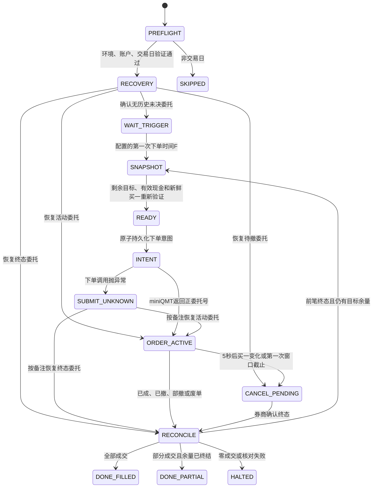
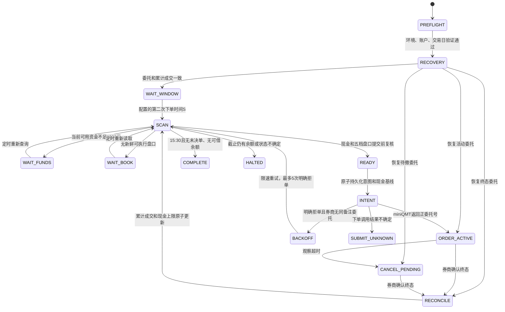

# 逆回购实盘执行状态机 v2

## 1. 验证边界

第一次与第二次执行器都直接使用
`scripts/repo_execution_state_machine.py` 中的转移表。形式模型、
生产程序和测试程序没有各自复制一套状态定义。

验证采用有限状态显式模型检查：从初始状态开始，对每个可达状态执行
全部合法事件，直到状态集合不再增长。循环不按固定步数截断，因此覆盖的
是有限抽象模型的完整可达图，而不是随机测试或有限长度路径抽样。

模型明确依赖以下外部假设：

1. miniQMT 查询成功并返回非 `None` 时，返回的是该次查询的完整结果。
2. 券商使用委托号和委托备注稳定标识当日委托。
3. Windows 文件锁能排除本机并发执行器。
4. 同一文件系统内的 `fsync + os.replace` 提供原子日志替换。

代码不把这些假设默认为永远成立：查询返回 `None`、抛异常、出现未知
委托状态、重复备注、日志损坏或撤单未终结时，一律进入安全停机，不允许
继续下单。无法从客户端软件证明交易所或券商内部实现正确。

## 2. 订单状态分类

| miniQMT状态 | 含义 | 执行器分类 | 是否允许下一单 |
|---|---|---|---|
| 48、49、50 | 未报、待报、已报 | 活动委托 | 否 |
| 51、52 | 已报待撤、部成待撤 | 撤单处理中 | 否 |
| 55 | 部成 | 活动委托 | 否 |
| 53、54 | 部撤、已撤 | 终态 | 完成资金核对后才允许 |
| 56 | 已成 | 终态 | 完成资金核对后才允许 |
| 57 | 废单 | 终态 | 完成资金核对后才允许 |
| 255或其他值 | 未知 | 不确定 | 否，人工检查 |

成交数量达到委托数量时，即使状态推送仍滞后，也按已成终态处理。除此
之外，不用“是否可撤”代替“是否终态”。

## 3. 第一次状态机



任何查询不确定、未知状态、撤单拒绝或撤单超时都进入 `HALTED`。第一次
委托按完整剩余目标挂在买一，不再要求当时买一可见量覆盖全部委托；成交
和委托推送只唤醒主循环，最终状态仍以每0.2秒同步查询为准。从配置的第一次
下单时间F（默认09:30:42）起，最多5分钟内每5秒复核新鲜买一：价格不变则
保留原单的时间优先级，价格变化才先撤单。只有券商确认前笔终态并核对累计
成交后，才允许按剩余目标重挂；到F+5分钟或当前交易时段结束时停止新委托并
撤销未成交余量，剩余
资金由第二次策略继续处理。第一次目标本金按配置比例乘以首次核验的可用资金
后向下取整到1000元；默认比例
为90%。第二次目标本金按第二次首次有效资金快照乘以配置比例后冻结，并在每次
成交后扣减；默认比例为100%。任一比例为0时对应任务不启用。F、S或任一资金
比例发生变化时，旧模拟证书均不能通过
实盘启用门禁。

## 4. 第二次状态机



第二次不会因为配置的开始时刻资金被人工委托占用就结束，而是持续重新查询到
15:30；11:30至13:00只等待。任一时刻最多允许一笔本策略委托处于非终态。

默认配置下任务15:08启动、15:09连接miniQMT，15:10开始查询并借出；修改
第二次时间后，任务启动和预连接时间会自动前移。默认时点晚于股票15:00收盘，
避免逆回购提前占用可能用于买股的现金；同时仍保留20分钟处理部分成交、
撤单重报和异常。243日分钟样本中15:10平均报价比15:01高
约2.10bp；最近21日、900万元双市场五档样本中高约2.63bp。历史结果只用于
选择固定时点，不构成收益保证。

## 5. 持久化与崩溃恢复

每次外部下单前，日志先原子写入以下内容：

- 唯一委托备注；
- 证券、方向、数量和限价；
- 提交前重新查询的有效现金；
- 报价时间和报价年龄；
- 当前状态机快照。

如果进程在下单调用期间终止，重启后必须先按备注查询当日全部委托：

- 唯一匹配：接管该委托并继续终态管理；
- 多个匹配：安全停机；
- 没有匹配但存在持久化意图：不能证明未成交，安全停机；
- 查询为 `None` 或抛异常：安全停机。

第一次和第二次日志还持久化：

- 已由券商委托累计确认的成交本金；
- 最近一次提交前的有效现金基线；
- 成交尚未反映到资产字段时的现金上限。

恢复时使用券商累计成交减去日志已核对成交计算增量。没有持久化现金
基线的新增成交不能自动推断，必须停机。只有资产现金下降到保护上限附近，
保护上限才解除；之后人工释放的新资金才能重新参与扫描。

## 6. 已证明的安全不变量

模型检查器对完整可达图验证：

1. 未通过环境和账户绑定，不存在下单路径。
2. 未完成当日券商委托核对，不存在下单路径。
3. 未取得提交前现金和新鲜报价，不存在下单路径。
4. 没有原子持久化意图，不存在外部委托路径。
5. 存在未决委托时，不能回到 `READY`。
6. 成功完成状态中不存在未决委托。
7. 第一次重挂前，上一笔委托必须已经确认终态。
8. 每个声明状态和每条声明转移都可达并被测试执行。
9. 每个可达非终态至少存在一条到终态的路径。
10. 未识别事件不能隐式忽略，只能抛出非法转移错误。

运行：

```powershell
.\.venv\Scripts\python.exe scripts\verify_repo_state_machines.py
```

发布门禁同时核对状态转移表哈希、安全执行源文件的组合哈希、本机
XtQuant运行库哈希和两项执行时间。证书不按日历时间过期；同一份代码、
同一套XtQuant和同一执行时刻只需验证一次。代码、状态转移、执行时间或
XtQuant发生变化时，旧证书因哈希不匹配自动失效；也可用`rr reset`手动撤销。
两项资金比例不绑定全日能力证书，而由`rr on`生成的HMAC签名启用快照精确锁定。
`rr add`只安装禁用任务；
`rr on`在形式验证、实盘账户哈希绑定、模拟接口和订单生命周期验证全部
通过前会拒绝启用。故障邮件是可选旁路，不属于启用门禁。实盘任务不启用“错过后立即补跑”，
因此收盘后启用只影响下一个计划时点。

每个实盘封装在解析参数后、连接miniQMT前核对启用快照。当前四项参数、模拟
证书、执行源码或XtQuant与`rr on`时不一致都会立即停止。`rr off`、`rr add`、
`rr del`和`rr reset`会撤销快照。这样资金比例可在不重复全日认证的情况下调整，
但启用后不能静默改变。

## 7. 安全停机邮件

两个执行器在进入 `HALTED` 后发送邮件，不把邮件发送结果作为交易状态
转移条件：

- 未配置邮件时执行器照常运行，`rr on`也不会因此失败；
- 配置缺失、损坏、密码解密失败或SMTP不可用时只记录本地警告；
- 邮件发送前，`HALTED` 和失败原因必须已经原子写入日志；
- 邮件失败不会重开状态机、补单、撤单或改变退出码；
- SMTP最多进行3次有界重试，每次连接超时10秒；
- 同一日志中的同一失败键发送成功后，重启不会重复发送；
- 邮件只包含策略、环境、状态、原因、未决委托标志和本机日志路径，
  不包含证券账号或SMTP密码。

配置命令：

```powershell
.\rr mail
```

收件地址、SMTP主机等非机密配置保存在被忽略的
`config/repo_failure_email.local.json`；SMTP密码使用Windows当前用户
DPAPI加密保存在`config/repo_failure_email_secret.local.clixml`。
